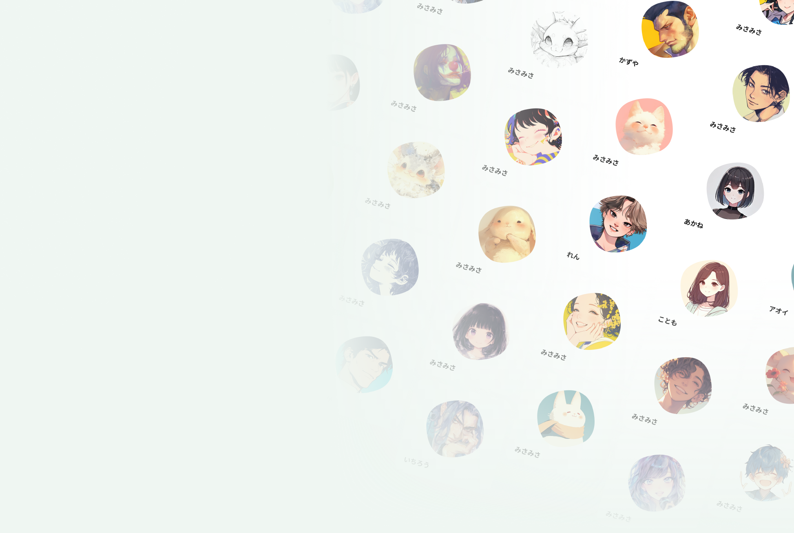
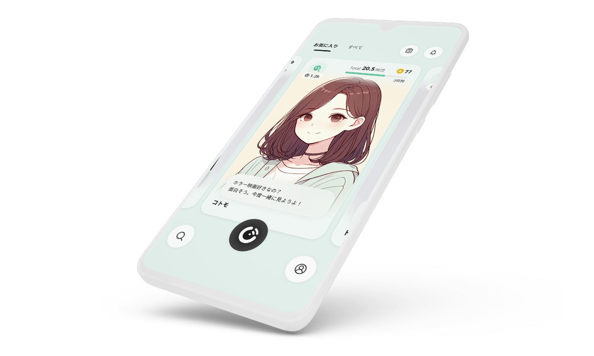
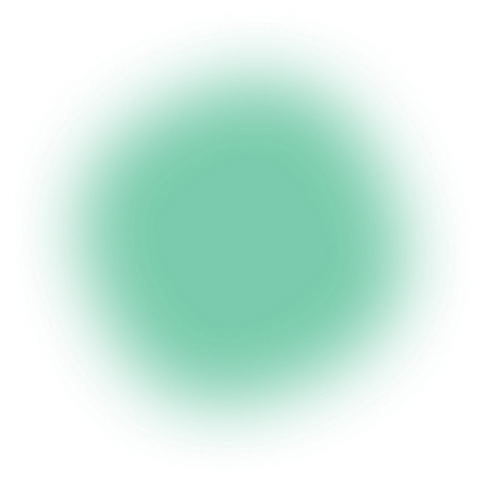

<!-- レイアウト: title-logo -->
<!--
_backgroundColor: #F3FBF8
-->

  

# Cotomo 1分ピッチ

Starley株式会社 ｜ VPoE 篠原 祐貴

---

<!-- レイアウト: split-2col-wide -->
<!--
_backgroundColor: #F3FBF8
-->

篠原 祐貴

Starley株式会社 VPoE

ヤフーを経て、Schoo初代CTO、メドピア技術部長、マネーフォワードケッサイ取締役CTOを歴任。その後SpirのCRO兼CTO、LegalscapeのVPoEを務めるなど、一貫して技術組織の牽引とバリューの最大化に従事。

現在はStarleyのVPoEとして、エンジニアリングが創出する価値の全体設計を担当。AIと人が共創する「AIネイティブ」なプロダクト組織の実現をリードしています。

  Yahoo!
  Schoo CTO
  メドピア
  MFケッサイ CTO
  Spir CRO/CTO
  Legalscape VPoE
  Starley VPoE

---

<!-- レイアウト: title-center-sub -->
<!--
_backgroundColor: #F3FBF8
-->

## 2023年4月創業 ｜ AI関連プロダクトの企画・開発

---

<!-- レイアウト: product-split（PPTX再現） -->
<!--
_backgroundColor: #F3FBF8
-->

  

    
だれと、 おしゃべりする？

    
    
おしゃべりAI コトモ

  

  

    
  

---

<!-- S5: 機能紹介（PPTX slide2再現） -->
<!--
_backgroundColor: #F3FBF8
-->

  

    
声、アイコン、性格をカスタマイズして <strong>AIキャラを作成</strong>

    

      
      
      
      

        
ハイクオリティな

        
声

      

      

        
作り込める

        
性格

      

      

        
自由に設定

        
アイコン

      

    

  

  

    
他のユーザーが作成したキャラと出会う <strong>プラットフォーム</strong>

    

      
      
      
      

        
キャラを

        
公開

      

    

  

---

<!-- S6: ユーザー数（PPTX slide3再現） -->
<!--
_backgroundColor: #FFFFFF
-->

  
200万

  
ユーザー突破！

---

<!-- S7: 累計おしゃべり時間（PPTX slide4再現） -->
<!--
_backgroundColor: #FFFFFF
-->

  

  

  

  
全ユーザー累計おしゃべり時間

  

    250
    万
    時間
  

  

    リリースから1.5年で、約285年分のおしゃべり時間！
  

---

<!-- S8: CTA（PPTX slide5再現） -->
<!--
_backgroundColor: #FFFFFF
-->

  
  
今すぐ おしゃべり！

  

  
おしゃべりAI コトモ

  

    
    

      
https://cotomo.ai/

    

  

---

<!-- レイアウト: title-center -->
<!--
_backgroundColor: #F3FBF8
-->

# Cotomo 1分ピッチ

---

<!--
_backgroundColor: #F3FBF8
-->

# 3つだけ、覚えてください。

  
Cotomo

  
AIキャラクター市場

  
採用

<!-- スピーカーノート: 最初に、これだけ覚えていてください。Cotomo。AIキャラクターという新しいエンタメ市場。そして、デザイナとエンジニアを本気で募集しています。これだけ覚えてもらえれば大丈夫です。 -->

---

<!--
_backgroundColor: #F3FBF8
-->

# 聞いたこと、ありますか？

<!-- スピーカーノート: ひとつだけ聞かせてください。Cotomoという、AIキャラクターとおしゃべりできるアプリを、聞いたことあるかも？という人、どれくらいいますか？（挙手を促す）ありがとうございます。 -->

---

<!--
_backgroundColor: #F3FBF8
-->

# AIキャラクターという 新しいエンタメ市場が、 世界的に、静かに立ち上がっている。

<!-- スピーカーノート: まだ知らない人のほうが多いですよね。でも実は今、AIキャラクターと話し、自分の言葉で物語や体験が変わっていく——そんな新しいエンタメ市場が、世界的に静かに立ち上がっています。 -->

---

<!--
_backgroundColor: #F3FBF8
-->

200万+ DL

## 日本では、今が一番大事なタイミングだ。

<!-- スピーカーノート: リリース直後に100万、200万ダウンロードに到達するプロダクトも出てきていて、日本では、今が一番大事なタイミングです。 -->

---

<!--
_backgroundColor: #F3FBF8
-->

# 市場の成長と 一緒にいるフェーズだ。

乗るのではない。作る。

<!-- スピーカーノート: Cotomoは、日本発でこの市場を作りにいっています。成された市場に乗るのではなく、市場の成長と一緒にいるフェーズです。だから正直に言うと—— -->

---

<!--
_backgroundColor: #F3FBF8
-->

# 一緒に作る側として、 ぜひ助けてください。

Designer & Engineer 募集

  
  

    
    
https://cotomo.ai/

  

<!-- スピーカーノート: フルコミットできるデザイナとエンジニアが、本当に必要です。今しかできないこの挑戦を、一緒に作る側として、ぜひ助けてください。 -->
